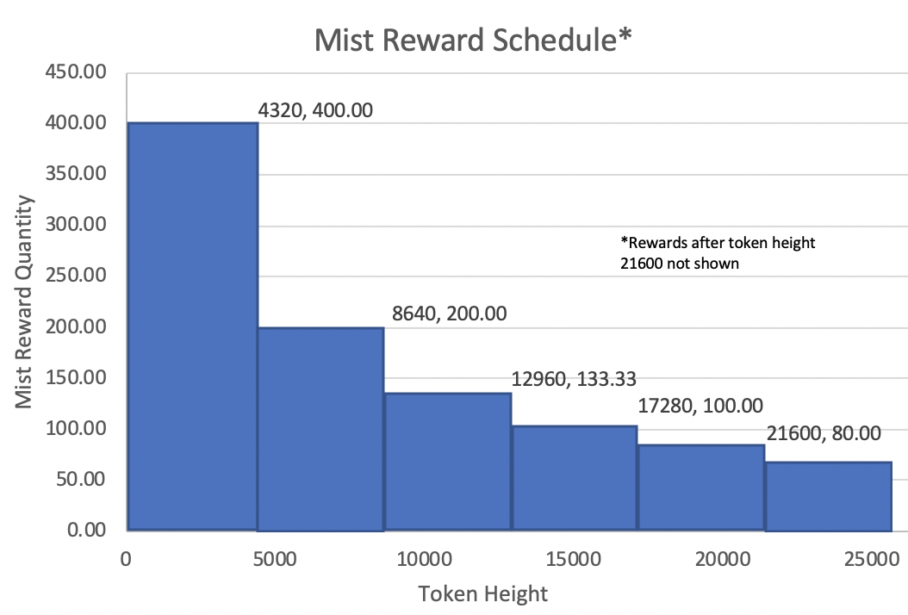
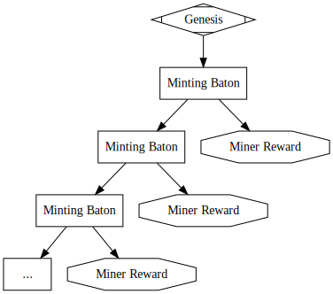

# Mist

*A mineable SLP token using a proof-of-work covenant contract*

Last Updated: June 19, 2020

[mistcoin.org](https://mistcoin.org)


### Introduction

Mist is an SLP token that can be generated by proof-of-work mining and is governed by a simple, but novel, bitcoin script.  The script is a stateful covenant contract that provides validation for an acceptable mining solution and a scheduled mining reward amount.  A constant proof-of-work difficulty requirement coupled with `OP_CHECKLOCKTIMEVERIFY` keeps Mist synchronized with the underlying blockchain block height.  As far as we are aware, Mist is the first fully autonomous, decentralized, mineable token built on bitcoin.

Prior to Mist, minting of SLP tokens has been generally centrally controlled by token creators.  Mining SLP tokens allows token minting to be decentralized using a permissionless process.  Furthermore, the token mining concept may be integrated in decentralized applications beyond the purpose of winning token rewards and may leverage a mining process to facilitate a number of interesting concepts, some of which are described below.

This project provides script contracts, a basic miner, and test code to facilitate mining for Mist and creating your own mineable SLP token.  The supplied code should be considered to be unaudited and should be peer-reviewed prior to production use in your own project.  The provided code and documentation should allow the concept of proof-of-work mineable SLP tokens to be improved and innovated upon by future works.

Mist Token ID is: `d6876f0fce603be43f15d34348bb1de1a8d688e1152596543da033a060cff798`


### Mist Rewards

Mist has a simple rewards emission schedule that decreases the mining reward amount every 4320 blocks (about 30 days).  The reward amount is governed by the following snippet from `./spedn/slp-miner-reward-v1.spedn`:

```
// calculate proper mintAmount based on current token height
int divisor = (tokenHeight / halvingInterval) + 1;
verify mintAmount == num2bin(initialMintAmount / divisor, 4);
```

where,

`tokenHeight` - An internal counter state of mining events (similar to block height), no reward for 0 height
`halvingInterval` - The interval to trigger a reward reduction
`divisor` - The amount the initial reward is divided by
`initialMintAmount` - The initial reward amount, i.e., 400
`mintAmount` - The reward amount received by a successful miner



The Mist mining rewards will stop when the `tokenHeight` state variable overflows at a value of 2,147,483,648 which would occur in the year 42,877 (or 40,857 years from now) if Mist miners continue to mine blocks and keep up with the underlying blockchain block height.

The circulating supply of Mist approaches 21 million over a very long period of time, but the supply will never reach that value.  The following table summarizes the maximum possible circulating supply of Mist over time assuming mining is kept in sync with the underlying blockchain block height.

| Time After Genesis | Maximum Possible Circulating Supply |
| :----------------: | :---------------------------------: |
|        0 d         |                  0                  |
|        1 d         |               57,600                |
|        30 d        |              1,728,000              |
|        60 d        |              2,592,000              |
|        90 d        |              3,168,000              |
|       120 d        |              3,600,000              |
|       150 d        |              3,945,600              |
|       180 d        |              4,233,600              |
|       210 d        |              4,480,500              |
|       240 d        |              4,696,500              |
|       270 d        |              4,888,500              |
|       300 d        |              5,061,300              |
|       330 d        |              5,218,400              |
|        1 y         |              5,400,000              |
|        5 y         |              8,100,000              |
|        10 y        |              9,300,000              |
|        25 y        |             10,800,000              |
|        50 y        |             12,080,000              |
|       100 y        |             13,270,000              |
|      1,000 y       |             17,250,000              |
|      40,857 y      |            < 21,000,000             |

Mining for Mist rewards requires discovery of a sha256 hash of a 4-byte random mining solution concatenated to the transaction preimage that has 6 leading zeros.   The rewards are limited to 1 reward every 10 minutes by using the `OP_CHECKLOCKTIMEVERIFY` opcode.


### A Stateful Covenant Contract

Covenant contracts enforce specific constraints on a spending transaction's input and/or output values.  These types of contracts have been studied extensively in the bitcoin community and typically work through introspection of the spending transaction's pre-hash image (or "preimage") which is validated by using both bitcoin script opcodes  `OP_CHECKSIG ` and `OP_CHECKDATASIG` .  A "stateful" covenant contract also has an internally managed state that is validated in the spending transaction and typically allows the user to propose changes to the contract's current state by pushing the new data into the scriptSig which the contract will validate and result in a new contract address.  This is not a new concept and has been demonstrated previously by Tobias Ruck with his blockchain chess application[2].  In this project, "token height" is the only internal state variable and it must be incremented by a value of 1 in each minting transaction.  The following figure illustrates the structure of the Mist miner rewards transaction graph.



The contract checks that a user supplied token height state has been properly incremented by a value of 1, and also checks that a user supplied mining solution produces a hash that contains 6 leading zeros when combined with the transaction's preimage (i.e., `sha256(preimage + mining solution) == 0x000123...abc`).

This project contains four versions of covenant contracts, but only the v1 was fully developed for the purpose creating the SLP Mist mineable token.  The remaining versions have been left for the purpose of experimentation, learning, and further exploration.  We hope others to use this project to further explore the possibility of building trustless decentralized applications that use SLP tokens.

Here are descriptions of the various covenants scripts contained within this project:

- `slp-miner-reward-v0.spedn` = Produces a constant mining reward, constant hashing rate (difficulty = 2)
- `slp-miner-reward-v1.spedn` = Produces a variable mining reward with 8 halving events, constant hashing rate (difficulty = 2), and has a CLTV set to 1 block so that SLP mining matches blocks
- `slp-miner-reward-v2.spedn` = Same as v1 plus a Difficulty Adjustment Algorithm driven by baton value amount, higher BCH value on the baton results in higher mining difficulty
- `slp-miner-reward-v3.spedn` = (Not completed) Same as v2 plus an additional dev fund p2sh output


### Getting Started with Mist and SLP Token Mining

The v1 contract source code is located in the `spedn` folder and can be re-compiled using the instructions found below, but this is not required.  The v1 contract template has already been compiled and is stored in the variable named `MINER_COVENANT_V1` within the supplied `.env` file for this repository to expedite the process of getting started with SLP mining.

Mine for Mist using the following steps:

1. **Setup Your Mining Address:** Use the "Addresses" tab in Electron Cash SLP (View > Show Addresses) to choose a constant address to provide funding for the mining transaction fees.  It may help if you add a label to the address so you can remember the proper address.  Once you have selected the address you need to extract the private key WIF from the wallet and then copy that value to the `WIF` variable within this project's `.env` file.  You may optionally edit `.env` variable `MINER_UTF8` to post a custom message within the scriptSig of mined Mist transactions.  To locate the address WIF in Electron Cash SLP, right click on the address and select "Private key".

2. **Transaction Fees:** You'll need to pay the transaction fees associated with the transaction containing any mining rewards you win.  To handle this we're going to pre-prepare some tiny low value UTXOs that can be consumed in the winning transactions. You can leverage the multiple BCH output feature of Electron Cash SLP to accomplish this (e.g., within the Send tab PayTo field paste the value `simpleledger:<address associated with WIF>, 0.00001870` multiple times).

3. **Install Modules:** Run `npm i` to install the required npm modules and also `npm run tsc` to compile the TypeScript source to javascript

4. **Initialize Contract:** Run `node ./src/init` script to figure out the initial P2SH contract address, then send the mint baton to the computed P2SH address using the Electron Cash SLP Mint Tool with a quantity of 0 tokens minted.

5. **Start Mining:** Run `node ./src/miner` to start mining.


### Compiling the Covenant Contract from Source

Spedn 0.3.0 should be installed using instructions at https://spedn.readthedocs.io.

Compile contract v1 using dummy values for the variables for `stateT0` and `tokenId`.  The integer values for `initialMintAmount`, `difficultyLeadingZeroBytes`, `halvingInterval`, `startingBlockHeight`, and `finalTokenHeight` should be provided according to token requirements.

The following command can be used to compile the contract:

```
$ export $(grep -v '^#' .env | xargs)
$ spedn compile -c ./spedn/slp-miner-reward-v1.spedn -h stateT0=0x1111111111 tokenId=0x33333333333333333333 initialMintAmount=${TOKEN_INIT_REWARD_V1} difficultyLeadingZeroBytes=${MINER_DIFFICULTY_V1} halvingInterval=${TOKEN_HALVING_INTERVAL_V1} startingBlockHeight=${TOKEN_START_BLOCK_V1}
```

For Mist the environment variables are:

```
TOKEN_START_BLOCK_V1=639179
TOKEN_INIT_REWARD_V1=400000000
TOKEN_HALVING_INTERVAL_V1=4320
MINER_DIFFICULTY_V1=3
```

The compiled contract hex should be pasted into the `MINER_COVENANT_V1` variable in the `.env` file, removing the dummy variable components of the contract since those parts will be added programatically.

The other experimental contracts included in this project (v2/v3) did not received as much attention and have many items hard coded.  These can be compiled using dummy variables for `state_t0`, `rawscrBaseSha256`, and `tokenId`:

```
$ export $(grep -v '^#' ../.env | xargs)
spedn compile -c ./spedn/slp-miner-reward-v2.spedn -h state_t0=0x1111111111 rawscrBaseSha256=0x222222222222222222222222 tokenId=0x33333333333333333333
```

To get the base script, take the result from this remove the dummy variables, then populate into the `.env` file.  But, don't forget to optimize your nips (detailed in the next section), if you need to.


### Testing

The unit tests require running a regtest network.  Refer to the `README.md` file located in the `test` directory.


### Lessons Learned

During the building of this project there were a few useful things about script that we learned, and we have attached these as appendices, including:

1. <u>Appendix A</u>: Some script compilers can leave a string of trailing `OP_NIP`, and these operations can be optimized and reduced by up to almost 50% using the post-processing script provided in this project.
2. <u>Appendix B</u>: `OP_CODESEPARATOR` was used to develop v2 of the covenant contract in order to allow for larger script sizes.  The usefulness of this opcode has been debated by the bitcoin community[1], and some have suggested the opcode has no purpose and should be removed entirely.  During the experimental phases of this project we used this opcode to build larger covenant contracts which would have otherwise been impossible due to a transaction preimage exceeding 520-bytes.


### Future Use Cases & Other Considerations

- Oracles and Decentralized Remote Control. Its possible an application's behavior could be controlled by data located in the scriptSig of the current mint baton location.  This would allow for individuals to compete or vote for control of an application with proof-of-work mining.
- Random number generation (e.g., loot boxes or other games of chance).  Mint mining can be used to generate a trail of trustless random numbers where miners are incentivised with rewards to mine random numbers honestly for players.  The miners' reward to incentive them to mine honestly needs to be sufficiently higher than the amount related to the gaming wager amount or cost for the end user who will be utilizing the random number generated by the miners.
- Non-fungible token (NFT) generation.  NFTs can be used in games such that their token ID defines their in-game attributes.  Token IDs can be easily manipulated with grinding algorithms to modify the scriptSig of the NFT Genesis inputs.  Mint mining can guard against this by requiring a sufficient amount of work to be generated before the NFT can be produced.
- Mining for BCH rewards instead of SLP.  It is possible to lockup a BCH amount within the minting baton value and modify the covenant to control the amount of BCH rewarded at each SLP minting event.
- Difficulty adjustment.  The v1 covenant script only used constant difficulty, which could be  updated to be something like the v2 covenant script.
- Bitcoin-like Halving Behavior.  The halving algorithm included in this project is not a true halving like bitcoin.  An additional state variable could be added to the contract in order to mimic the halving behavior of bitcoin if that was desired.
- Use NFT Group.  NFT1 Group could be mint mined but with the added benefit of being able to create NFTs from the minted token.


### Appendix A: Optimize Your Nips

The current version of spedn results in long strings of `OP_NIP` which is an inefficient way to clear the stack, and may cause you to exceed the 201 script operation limitation.  Instead of using a series of `OP_NIP` we can use a combination of `OP_TOALTSTACK OP_2DROP ... OP_FROMALTSTACK` to improve the efficiency of stack clearing operations by nearly 50%.  A simple script for post-processing a compiled contract script ending in a series of `OP_NIP` has been included.

Example `optimize_nips` usage:

`$ node ./scripts/optimize_nips <raw script> <nips start marker>`

`$ node ./scripts/optimize_nips 0511111111110c2222222222222222222222220a33333333333333333333537982775479780128947f7755795279012c947f7501687f777678827758947f775679547f5a79547f7881547981788c887603e77e039f695e79040084d717527902a866968b965480885e79537f78517f76517f040000000055797e787e52797e54797e0113790117797eaa5b79817f75810088011779547f768100887881760400752b7da16976021027967601209f635c79528867760200049f635c7953886776030080009f635c795488675c795588686868011c79547f788178810088011379547f75815579789f63780222025279587994938867780222028868012179a8011a7988012079041976a9147e012379a97e0288ac7e0120790317a9147e55011f797e01207e011c797e0124797ea97e01877e170000000000000000396a04534c50000101044d494e5420011b797e030102087e5b797e52797e787eaa01197901207f7588011179b175ab012579012579ad012579828c7f75011e79a8012679ba7777777777777777777777777777777777777777777777777777777777777777777777777777 ba77`

NOTE: `ba77` is used as a positional marker to tell the optimize_nips script where the string of OP_NIP (0x77) begins.  For different contracts replace `ba77` with the appropriate location marking the start of your series of OP_NIPs.


### Appendix B: Using OP_CODESEPARATOR

`OP_CODESEPARATOR` was used in experimental script contracts v2 and v3 to overcome the script push limit of 520 bytes.  These contracts result in a very large transaction preimage due to the large scriptCode part of the preimage.  In these experimental scripts, we used `OP_CODESEPARATOR` to circumvent the 520-byte limitation by reducing the size of scriptCode part of the preimage.  Future work may benefit from the use of `OP_CODESEPARATOR` because it allows scripts larger scripts otherwise limited by other components contained within the transaction preimage which must be pushed within scriptSig.  

Finally, because  `OP_CODESEPARATOR` results in a truncated scriptCode value we were required us to use of a sort of "wrapped p2sh" as a final step to validate the sha256 of the base covenant contract template was being honored in the transaction output.  This concept of a "wrapped p2sh" may be useful in future work to possibly overcome well-document concerns associated with p2sh collision attack[3] on only 80-bits, however, this would need to be investigated further.


### References

[1] https://bitcoin.stackexchange.com/questions/34013/what-is-op-codeseparator-used-for

[2] https://tobiasruck.com/content/lets-play-chess-on-bch/

[3] https://bitcoin.stackexchange.com/questions/54841/birthday-attack-on-p2sh

[4]